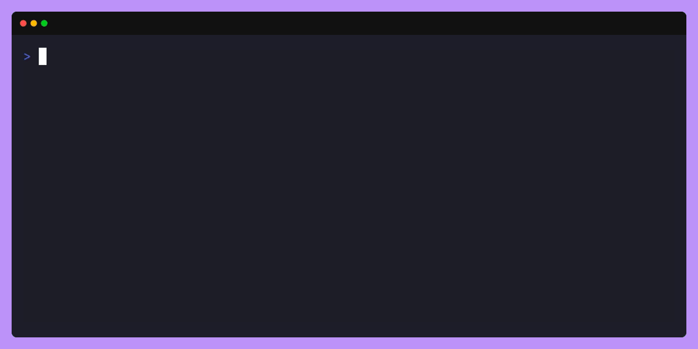

# 🏗️  Manual Installation

Manual installation is recommended when contributing, or making personal changes.

You will need some packages before you can run `qemantra`.See [here](/dependencies.html).

After installing the packages. 

- You can install the `go` compiler. 
- Clone the project and execute `make build.`

If you don't have make installed, you can also run

```sh
go build cmd/qemantra/main.go -o qemantra
```

This development binary would not have version info.



